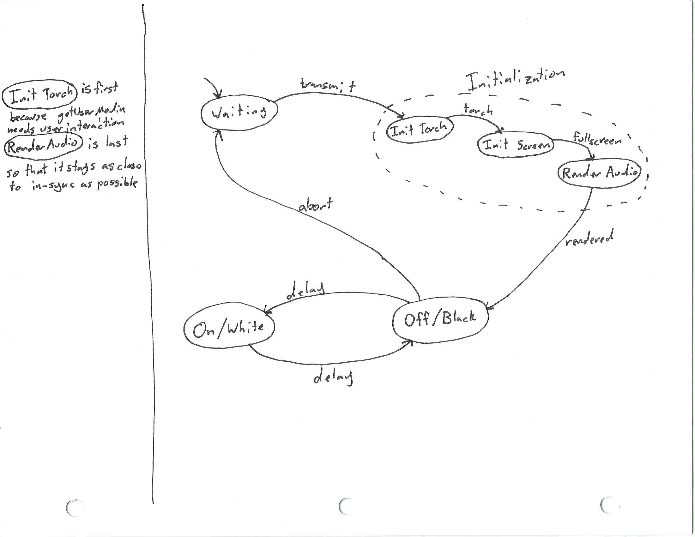

# Morse Code Transmitter App
A progressive web app that lets you send messages via morse code.
1. Works offline
2. Can send as audio, flashing your screen, or your camera's torch (on Android Chrome)

## Screenshots

## Tasks:
* [x] App Shell / Styling
* [x] Screen Output
* [x] Proper timing
* [x] Cancelling + No uncaught exceptions
* [x] Words Per Minute <-> Dot Time: [https://en.wikipedia.org/wiki/Morse_code#Speed_in_words_per_minute]
* [x] Torch Output
	* [https://stackoverflow.com/questions/37848494/is-it-possible-to-control-the-camera-light-on-a-phone-via-a-website]
* [x] PWA
	* [x] Cache Assets
	* [x] App Manifest
		* [x] Icons (Testing)
	* [x] Persist settings in local storage
	* [x] Persist input in session storage
	* [x] Redirect HTTP to HTTPS (Vercel does this automatically)
* [x] Audio Output
	* [x] Fix audio click / glitching (OfflineAudioContext prerendering?)

## Misc.
* Would using the web animation be better for controlling blinks?  I don't think it would be.
* Bundling / asset optimization

## State Machine
